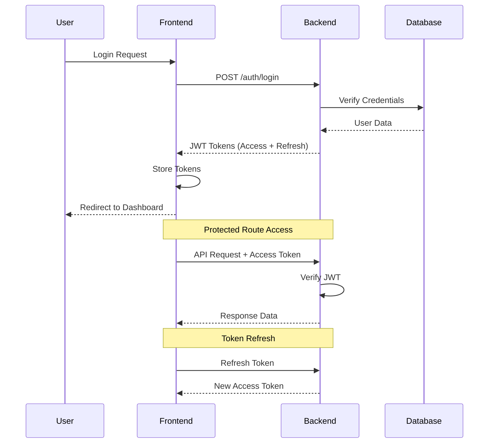

# 🏛️ Portal Nagari Guguak Malalo - Frontend

<div align="center">
  
  
  **Portal Resmi Nagari Guguak Malalo**  
  *Sistem Digital Terintegrasi untuk Pelayanan Publik dan Pemberdayaan Masyarakat*  
  *Kabupaten Tanah Datar, Sumatera Barat*
  
  [](https://nextjs.org/)
  [](https://reactjs.org/)
  [](https://www.typescriptlang.org/)
  [](https://tailwindcss.com/)
  [](https://tanstack.com/query/latest)
  [](https://github.com/pmndrs/zustand)
</div>

## 📋 Daftar Isi

- [🎯 Overview](#-overview)
- [✨ Fitur Utama](#-fitur-utama)
- [🛠️ Teknologi](#️-teknologi)
- [📁 Struktur Project](#-struktur-project)
- [🚀 Quick Start](#-quick-start)
- [🔧 Konfigurasi](#-konfigurasi)
- [💻 Development](#-development)
- [🎨 UI Components](#-ui-components)
- [📱 Fitur Lengkap](#-fitur-lengkap)
- [🔐 Sistem Autentikasi](#-sistem-autentikasi)
- [📊 Performance](#-performance)
- [🔄 State Management](#-state-management)
- [📋 API Integration](#-api-integration)
- [🧪 Testing](#-testing)
- [🚀 Deployment](#-deployment)
- [🤝 Contributing](#-contributing)
- [📞 Support](#-support)

## 🎯 Overview

Portal ini menyediakan layanan digital untuk:
- **🏛️ Layanan Publik**: Surat keterangan, perizinan, dan dokumentasi resmi
- **📢 Informasi Nagari**: Berita terkini, pengumuman resmi, dan profil daerah
- **🏖️ Pariwisata**: Destinasi wisata unggulan dan paket promosi potensi daerah
- **🏪 UMKM**: Pendaftaran, verifikasi, dan promosi usaha mikro kecil menengah
- **👥 Portal Warga**: Dashboard pribadi untuk layanan resident terintegrasi
- **📊 Analytics**: Dashboard analitik dan pelaporan untuk administrasi

### 🎯 Visi & Misi

**Visi**: Menjadi portal digital terdepan yang memberikan pelayanan publik yang efisien, transparan, dan berkelanjutan untuk kemajuan Nagari Guguak Malalo.

**Misi**:
- Digitalisasi penuh layanan pemerintahan nagari
- Pemberdayaan ekonomi lokal melalui platform UMKM
- Promosi potensi pariwisata daerah
- Peningkatan transparansi dan akuntabilitas pemerintahan
- Kemudahan akses informasi dan layanan bagi seluruh warga

## ✨ Fitur Utama

### 🔐 Authentication & Authorization
- JWT-based authentication dengan refresh token otomatis
- Role-based access control (RBAC) dengan 7 level user
- Route protection dengan middleware Next.js yang canggih
- Session management yang aman dengan enkripsi data
- Multi-factor authentication untuk admin (opsional)

### 🎨 Modern UI/UX
- Responsive design untuk semua device (mobile-first approach)
- Dark/Light theme dengan system preference detection
- Component library dengan Radix UI & shadcn/ui yang accessible
- Smooth animations dengan Tailwind CSS dan Framer Motion
- Progressive Web App (PWA) capabilities

### ⚡ Performance & Optimization
- Next.js 14 dengan App Router dan React Server Components
- Server-side rendering (SSR) dan Static Site Generation (SSG)
- Image optimization dengan Next.js Image dan lazy loading
- Bundle optimization, code splitting, dan tree shaking
- Advanced caching strategies dengan React Query

### 🔄 State Management
- React Query (TanStack Query) untuk server state dengan smart caching
- Zustand untuk client state management yang lightweight
- Form handling dengan React Hook Form dan Zod validation
- Real-time updates dengan WebSocket dan Socket.io integration
- Optimistic updates untuk better user experience

### 🛡️ Security & Best Practices
- TypeScript strict mode untuk type safety penuh
- Input validation dengan Zod schemas yang comprehensive
- Security headers, CSP, dan XSS protection
- Rate limiting, CORS protection, dan request throttling
- Code quality dengan ESLint, Prettier, dan Husky git hooks

### 📱 Mobile & Accessibility
- Touch-optimized interactions dan gesture support
- WCAG 2.1 compliance untuk accessibility
- Screen reader support dan keyboard navigation
- Optimized untuk koneksi lambat dan device resources terbatas

## 🛠️ Teknologi

### Core Framework & Language
- **[Next.js 14](https://nextjs.org/)** - React framework dengan App Router
- **[React 18.2](https://reactjs.org/)** - UI library dengan Concurrent Features
- **[TypeScript 5.0](https://www.typescriptlang.org/)** - Type-safe JavaScript superset
- **[Node.js 18+](https://nodejs.org/)** - JavaScript runtime environment

### Styling & UI Components
- **[Tailwind CSS 3.4](https://tailwindcss.com/)** - Utility-first CSS framework
- **[Shadcn/ui](https://ui.shadcn.com/)** - Re-usable component collection
- **[Radix UI](https://www.radix-ui.com/)** - Headless UI primitives
- **[Lucide React](https://lucide.dev/)** - Beautiful icon library
- **[Framer Motion](https://www.framer.com/motion/)** - Animation library

### State Management & Data Fetching
- **[TanStack Query 5](https://tanstack.com/query/latest)** - Server state management
- **[Zustand 4.5](https://github.com/pmndrs/zustand)** - Client state management
- **[React Hook Form](https://react-hook-form.com/)** - Performant form library
- **[Zod](https://zod.dev/)** - TypeScript schema validation

### Development Tools & Quality
- **[ESLint](https://eslint.org/)** - Code linting dengan custom rules
- **[Prettier](https://prettier.io/)** - Code formatting yang konsisten
- **[Husky](https://typicode.github.io/husky/)** - Git hooks untuk quality gates
- **[TypeScript ESLint](https://typescript-eslint.io/)** - TypeScript-specific linting

### Maps & Geolocation
- **[Leaflet](https://leafletjs.com/)** - Interactive maps untuk tourism
- **[React Leaflet](https://react-leaflet.js.org/)** - React wrapper for Leaflet

### Testing & Monitoring
- **[Jest](https://jestjs.io/)** - JavaScript testing framework
- **[React Testing Library](https://testing-library.com/)** - Simple component testing
- **[Playwright](https://playwright.dev/)** - End-to-end testing
- **[MSW](https://mswjs.io/)** - API mocking untuk development

## 🚀 Quick Start

### Prerequisites

- Node.js >= 18.0.0
- npm >= 8.0.0
- Git

### Installation

1. **Clone the repository**
   ```bash
   git clone https://github.com/your-org/nagari-guguak-malalo.git
   cd nagari-guguak-malalo/frontend
   ```

2. **Install dependencies**
   ```bash
   npm install
   ```

3. **Environment setup**
   ```bash
   cp .env.example .env.local
   # Edit .env.local with your configuration
   ```

4. **Start development server**
   ```bash
   npm run dev
   ```

5. **Open in browser**
   ```
   http://localhost:3000
   ```

## 🛠️ Development

## 💻 Development

### Available Scripts

| Command | Description | Usage |
|---------|-------------|-------|
| `npm run dev` | Start development server | Development dengan hot reload |
| `npm run build` | Build for production | Generate optimized production build |
| `npm run start` | Start production server | Jalankan production build locally |
| `npm run lint` | Run ESLint | Check code quality dan standards |
| `npm run lint:fix` | Fix ESLint issues | Auto-fix linting errors |
| `npm run type-check` | TypeScript checking | Validate TypeScript types |
| `npm run format` | Format with Prettier | Format kode secara konsisten |
| `npm run format:check` | Check formatting | Validate code formatting |
| `npm run test` | Run tests | Execute test suite |
| `npm run test:watch` | Run tests in watch mode | Test dengan auto-rerun |
| `npm run test:coverage` | Run tests with coverage | Test dengan coverage report |
| `npm run analyze` | Bundle analyzer | Analyze bundle size |

### Development Workflow

#### 🚀 Getting Started
```bash
# 1. Start development server
npm run dev

# 2. Server akan berjalan di:
# http://localhost:3000

# 3. Hot reload akan otomatis refresh saat ada perubahan file
```

#### 🔍 Code Quality Checks
```bash
# Check semua aspek code quality
npm run lint && npm run type-check && npm run format:check

# Auto-fix issues yang bisa diperbaiki
npm run lint:fix && npm run format
```

#### 🧪 Testing Workflow
```bash
# Jalankan semua tests
npm run test

# Development dengan test watching
npm run test:watch

# Generate coverage report
npm run test:coverage
```

### Development Guidelines

#### 📝 Code Standards
- **TypeScript Strict Mode**: Semua kode harus type-safe
- **ESLint Rules**: Follow Next.js dan React best practices
- **Prettier Formatting**: Konsisten code formatting
- **Conventional Commits**: Standardized commit messages

#### 🏗️ Component Development
```typescript
// Example: Membuat komponen baru
// src/components/ui/my-component.tsx

import { cn } from '@/lib/utils';
import { type ComponentProps } from 'react';

interface MyComponentProps extends ComponentProps<'div'> {
  variant?: 'default' | 'primary' | 'secondary';
  size?: 'sm' | 'md' | 'lg';
}

export function MyComponent({ 
  variant = 'default', 
  size = 'md',
  className,
  ...props 
}: MyComponentProps) {
  return (
    <div
      className={cn(
        'base-styles',
        {
          'variant-default': variant === 'default',
          'variant-primary': variant === 'primary',
          'size-sm': size === 'sm',
          'size-md': size === 'md',
        },
        className
      )}
      {...props}
    />
  );
}
```

#### 🪝 Custom Hook Development
```typescript
// Example: Membuat custom hook
// src/hooks/api/useMyFeature.ts

import { useQuery, useMutation, useQueryClient } from '@tanstack/react-query';
import { myFeatureService } from '@/api/services/myFeature.service';

export function useMyFeature(id: string) {
  return useQuery({
    queryKey: ['myFeature', id],
    queryFn: () => myFeatureService.getById(id),
    enabled: !!id,
    staleTime: 5 * 60 * 1000, // 5 minutes
  });
}

export function useCreateMyFeature() {
  const queryClient = useQueryClient();
  
  return useMutation({
    mutationFn: myFeatureService.create,
    onSuccess: () => {
      queryClient.invalidateQueries({ queryKey: ['myFeature'] });
    },
  });
}
```

#### 🗂️ File Naming Conventions
```
📁 Components:
- PascalCase untuk component files: `UserProfile.tsx`
- kebab-case untuk utility files: `user-utils.ts`

📁 Hooks:
- camelCase dengan 'use' prefix: `useUserProfile.ts`
- Feature-based organization: `api/useUsers.ts`

📁 Types:
- camelCase untuk files: `userTypes.ts`
- PascalCase untuk interfaces: `interface UserProfile {}`

📁 Utils:
- kebab-case: `date-utils.ts`
- camelCase untuk functions: `formatDate()`
```

### Debugging & Development Tools

#### 🔧 VS Code Extensions (Recommended)
```json
// .vscode/extensions.json
{
  "recommendations": [
    "ms-vscode.vscode-typescript-next",
    "bradlc.vscode-tailwindcss",
    "esbenp.prettier-vscode",
    "ms-vscode.vscode-eslint",
    "ms-vscode.vscode-json"
  ]
}
```

#### 🛠️ Browser DevTools
- **React Developer Tools**: Component tree inspection
- **TanStack Query DevTools**: Server state debugging
- **Redux DevTools**: Client state debugging (jika diperlukan)
- **Lighthouse**: Performance auditing

#### 📊 Performance Monitoring
```bash
# Bundle analyzer untuk check size
npm run analyze

# Lighthouse audit
npm run audit

# Type checking performance
npm run type-check -- --listFiles
```

### Environment-Specific Development

#### 🏠 Local Development
```bash
# Development dengan mock data
NEXT_PUBLIC_MOCK_API=true npm run dev

# Development dengan real API
NEXT_PUBLIC_MOCK_API=false npm run dev
```

#### 🧪 Testing Environment
```bash
# Test environment setup
NODE_ENV=test npm run test
```

#### 🚀 Production Testing
```bash
# Build dan test production locally
npm run build && npm run start
```

## 📁 Struktur Project

```
src/
├── 📁 api/                           # API layer & services
│   ├── client.ts                     # Base API client dengan interceptors
│   ├── endpoints.ts                  # Konfigurasi endpoint API
│   ├── interceptors.ts               # Request/response interceptors
│   ├── types.ts                      # API type definitions
│   ├── 📁 services/                  # Service modules
│   │   ├── auth.service.ts           # Authentication services
│   │   ├── user.service.ts           # User management services
│   │   ├── article.service.ts        # Article/news services
│   │   ├── tourism.service.ts        # Tourism services
│   │   ├── umkm.service.ts           # UMKM services
│   │   ├── document.service.ts       # Document services
│   │   ├── notification.service.ts   # Notification services
│   │   └── ...                       # Other service modules
│   └── 📁 types/                     # API type definitions
│       ├── auth.ts                   # Authentication types
│       ├── user.ts                   # User types
│       ├── common.ts                 # Common API types
│       └── ...                       # Feature-specific types
├── 📁 app/                           # Next.js App Router
│   ├── layout.tsx                    # Root layout component
│   ├── page.tsx                      # Homepage
│   ├── globals.css                   # Global styles
│   ├── providers.tsx                 # App-wide providers
│   ├── 📁 admin/                     # Admin dashboard routes
│   │   ├── layout.tsx                # Admin layout
│   │   ├── page.tsx                  # Admin dashboard
│   │   ├── 📁 berita/                # News management
│   │   ├── 📁 pengguna/              # User management
│   │   ├── 📁 pariwisata/            # Tourism management
│   │   ├── 📁 umkm/                  # UMKM management
│   │   └── ...                       # Other admin routes
│   ├── 📁 portal-warga/              # Citizen portal routes
│   │   ├── layout.tsx                # Portal layout
│   │   ├── page.tsx                  # Portal dashboard
│   │   ├── 📁 profile/               # Profile management
│   │   ├── 📁 layanan/               # Services
│   │   └── ...                       # Other portal routes
│   ├── 📁 pariwisata/                # Tourism public routes
│   ├── 📁 umkm/                      # UMKM public routes
│   ├── 📁 informasi/                 # Information routes
│   └── 📁 api/                       # API routes
├── 📁 components/                    # React components
│   ├── 📁 ui/                        # Base UI components (shadcn/ui)
│   │   ├── button.tsx                # Button component
│   │   ├── card.tsx                  # Card component
│   │   ├── form.tsx                  # Form components
│   │   ├── dialog.tsx                # Modal/dialog components
│   │   └── ...                       # Other UI components
│   ├── 📁 layout/                    # Layout components
│   │   ├── Navbar.tsx                # Main navigation
│   │   ├── Footer.tsx                # Footer component
│   │   ├── Sidebar.tsx               # Sidebar navigation
│   │   └── Breadcrumb.tsx            # Breadcrumb navigation
│   ├── 📁 home/                      # Homepage components
│   │   ├── HeroSection.tsx           # Hero section
│   │   ├── QuickServices.tsx         # Quick services
│   │   ├── NewsSection.tsx           # News section
│   │   └── ...                       # Other home components
│   ├── 📁 admin/                     # Admin-specific components
│   │   ├── 📁 layout/                # Admin layout components
│   │   ├── 📁 shared/                # Shared admin components
│   │   └── ...                       # Feature-specific admin components
│   ├── 📁 portal-warga/              # Portal warga components
│   ├── 📁 seo/                       # SEO components
│   │   ├── structured-data.tsx       # JSON-LD structured data
│   │   └── ...                       # Other SEO components
│   └── 📁 modals/                    # Modal components
├── 📁 hooks/                         # Custom React hooks
│   ├── index.ts                      # Main hooks export
│   ├── 📁 api/                       # API-related hooks
│   │   ├── useAuth.ts                # Authentication hooks
│   │   ├── useUsers.ts               # User management hooks
│   │   ├── useArticles.ts            # Article hooks
│   │   ├── useTourism.ts             # Tourism hooks
│   │   ├── useUMKM.ts                # UMKM hooks
│   │   └── ...                       # Other API hooks
│   └── 📁 ui/                        # UI-related hooks
│       ├── useModal.ts               # Modal state management
│       ├── usePagination.ts          # Pagination logic
│       ├── useDebounce.ts            # Input debouncing
│       └── ...                       # Other UI hooks
├── 📁 lib/                           # Utility libraries
│   ├── utils.ts                      # Common utilities
│   ├── seo.ts                        # SEO utilities
│   └── socket.ts                     # WebSocket utilities
├── 📁 providers/                     # React context providers
│   ├── AuthProvider.tsx              # Authentication provider
│   ├── QueryProvider.tsx             # React Query provider
│   ├── ErrorBoundaryProvider.tsx     # Error boundary provider
│   └── AnalyticsProvider.tsx         # Analytics provider
├── 📁 store/                         # Zustand stores
│   ├── authStore.ts                  # Authentication store
│   ├── userStore.ts                  # User data store
│   ├── themeStore.ts                 # Theme management store
│   ├── modalStore.ts                 # Modal state store
│   └── ...                           # Other stores
├── 📁 types/                         # TypeScript type definitions
│   ├── index.ts                      # Main types export
│   ├── auth.ts                       # Authentication types
│   ├── user.ts                       # User types
│   ├── article.ts                    # Article types
│   ├── tourism.ts                    # Tourism types
│   ├── umkm.ts                       # UMKM types
│   └── ...                           # Feature-specific types
├── 📁 utils/                         # Utility functions
│   ├── index.ts                      # Main utils export
│   ├── auth.ts                       # Auth utilities
│   ├── date.ts                       # Date utilities
│   ├── format.ts                     # Formatting utilities
│   ├── validation.ts                 # Validation schemas
│   └── ...                           # Other utilities
└── 📁 contexts/                      # Legacy React contexts
    ├── AuthContext.tsx               # Authentication context
    └── SocketContext.tsx             # WebSocket context
```

### Penjelasan Struktur

#### 🔧 API Layer (`/api`)
- **Centralized API management** dengan service pattern
- **Type-safe** API calls dengan TypeScript
- **Automatic retry** dan error handling
- **Request/response** interceptors untuk auth

#### 🎨 Components (`/components`)
- **Atomic design** pattern untuk reusability
- **Accessible** components dengan Radix UI
- **Consistent** styling dengan Tailwind CSS
- **Feature-based** organization

#### 🪝 Hooks (`/hooks`)
- **Custom hooks** untuk business logic
- **Separation** antara API dan UI hooks
- **Reusable** logic across components
- **Type-safe** hook interfaces

#### 🗂️ Store (`/store`)
- **Lightweight** state management dengan Zustand
- **Persistent** state untuk user preferences
- **Reactive** updates across components

## � Quick Start

### Prerequisites

- **Node.js** >= 18.17.0 (LTS recommended)
- **npm** >= 8.0.0 atau **yarn** >= 1.22.0
- **Git** untuk version control
- **Backend API** running (repository terpisah)

### Installation

1. **Clone repository**
   ```bash
   git clone https://github.com/Ryan-infitech/Frontend-Nagari-Guguak-Malalo.git
   cd Frontend-Nagari-Guguak-Malalo
   ```

2. **Install dependencies**
   ```bash
   npm install
   # atau menggunakan yarn
   yarn install
   ```

3. **Setup environment variables**
   ```bash
   cp .env.example .env.local
   ```

4. **Konfigurasi environment**
   Edit file `.env.local`:
   ```env
   # API Configuration (REQUIRED)
   NEXT_PUBLIC_API_URL=http://localhost:3001/api/v1
   NEXT_PUBLIC_BASE_URL=http://localhost:3001/api/v1
   NEXT_PUBLIC_SOCKET_URL=http://localhost:3001
   
   # Application Configuration
   NEXT_PUBLIC_APP_NAME="Portal Nagari Guguak Malalo"
   NEXT_PUBLIC_APP_VERSION=1.0.0
   ```

5. **Start development server**
   ```bash
   npm run dev
   # atau menggunakan yarn
   yarn dev
   ```

6. **Buka di browser**
   ```
   http://localhost:3000
   ```

### Verifikasi Installation

Setelah server berjalan, pastikan:
- ✅ Homepage dapat diakses dengan baik
- ✅ Navigation menu berfungsi normal
- ✅ Backend API connection berhasil (check browser console)
- ✅ Hot reload berfungsi saat edit file

## 🔧 Konfigurasi

### Environment Variables

Key environment variables in `.env.local`:

```bash
# API Configuration
NEXT_PUBLIC_API_URL=http://localhost:3001/api
NEXT_PUBLIC_BASE_URL=http://localhost:3000

# Application
NEXT_PUBLIC_APP_NAME="Portal Nagari Guguak Malalo"
NEXT_PUBLIC_SITE_URL=http://localhost:3000

# Authentication
JWT_SECRET=your-jwt-secret
NEXTAUTH_SECRET=your-nextauth-secret

# Features
NEXT_PUBLIC_ENABLE_ANALYTICS=true
NEXT_PUBLIC_ENABLE_NOTIFICATIONS=true
NEXT_PUBLIC_DEBUG_MODE=true
```

See `.env.example` for complete configuration options.

### API Integration

The frontend integrates with the backend API:

```typescript
// API Client Example
import { apiClient } from '@/api/client';

const response = await apiClient.get('/articles');
```

## 🎨 UI Components

Built with modern component libraries:

- **Radix UI**: Headless UI primitives
- **shadcn/ui**: Beautiful component collection
- **Tailwind CSS**: Utility-first CSS framework
- **Lucide React**: Beautiful icons

### Example Usage

```tsx
import { Button } from '@/components/ui/button';
import { Card, CardContent, CardHeader } from '@/components/ui/card';

function MyComponent() {
  return (
    <Card>
      <CardHeader>
        <h2>Portal Warga</h2>
      </CardHeader>
      <CardContent>
        <Button>Ajukan Surat</Button>
      </CardContent>
    </Card>
  );
}
```

## 📱 Fitur Lengkap

### 🌐 Public Features (Akses Umum)

#### 🏠 Homepage (`/`)
- **Hero Section**: Showcase utama nagari dengan visual menarik
- **Quick Services**: Akses cepat ke layanan populer
- **Latest News**: Berita dan pengumuman terbaru
- **Tourism Highlights**: Destinasi wisata unggulan
- **UMKM Showcase**: Produk UMKM lokal terfavorit
- **Statistics Dashboard**: Data real-time nagari

#### 📢 Informasi (`/informasi`)
- **News Articles**: Berita terkini dengan kategori
- **Announcements**: Pengumuman resmi pemerintah
- **Village Profile**: Profil lengkap nagari
- **Government Structure**: Struktur organisasi pemerintahan
- **Demographics**: Data kependudukan dan statistik
- **History**: Sejarah dan budaya nagari

#### 🛠️ Layanan (`/layanan`)
- **Service Catalog**: Katalog lengkap layanan pemerintah
- **Service Categories**: Pengelompokan layanan berdasarkan jenis
- **Requirements**: Persyaratan dan prosedur layanan
- **Service Status**: Track status pengajuan layanan
- **FAQ**: Pertanyaan yang sering diajukan
- **Contact Info**: Informasi kontak untuk setiap layanan

#### 🏖️ Pariwisata (`/pariwisata`)
- **Destination Gallery**: Galeri destinasi wisata dengan foto HD
- **Tourism Map**: Peta interaktif lokasi wisata
- **Tourism Packages**: Paket wisata dengan booking online
- **Events Calendar**: Kalender acara dan festival
- **Travel Guide**: Panduan wisata dan tips berkunjung
- **Weather Info**: Informasi cuaca dan musim terbaik

#### 🏪 UMKM (`/umkm`)
- **Business Directory**: Direktori lengkap UMKM lokal
- **Product Catalog**: Katalog produk dengan filter dan search
- **Business Registration**: Formulir pendaftaran UMKM online
- **Success Stories**: Kisah sukses UMKM lokal
- **Market Insights**: Analisis pasar dan trend
- **Business Support**: Program bantuan dan pelatihan

#### 📞 Kontak (`/kontak`)
- **Contact Information**: Informasi kontak lengkap
- **Office Hours**: Jam operasional kantor
- **Location Map**: Peta lokasi kantor nagari
- **Feedback Form**: Form feedback dan saran
- **Emergency Contacts**: Kontak darurat
- **Social Media**: Link ke media sosial resmi

### 🔐 Authenticated Features (Setelah Login)

#### 👥 Portal Warga (`/portal-warga`)

##### 📊 Dashboard (`/portal-warga/dashboard`)
- **Personal Overview**: Ringkasan data personal dan layanan
- **Service History**: Riwayat penggunaan layanan
- **Pending Requests**: Status pengajuan yang sedang berjalan
- **Notifications**: Notifikasi dan update terbaru
- **Quick Actions**: Akses cepat ke layanan populer
- **Digital Wallet**: Saldo dan transaksi digital (jika ada)

##### 👤 Profile Management (`/portal-warga/profile`)
- **Personal Information**: Data diri lengkap
- **Address Management**: Kelola alamat dan domisili
- **Document Upload**: Upload dokumen pendukung
- **Security Settings**: Pengaturan keamanan akun
- **Privacy Settings**: Kontrol privasi data
- **Account Verification**: Status verifikasi akun

##### 🛠️ Layanan Digital (`/portal-warga/layanan`)
- **Document Services**: Pengajuan surat dan dokumen
- **Permit Applications**: Permohonan izin dan perizinan
- **Form Library**: Template formulir digital
- **Service Tracking**: Track real-time status pengajuan
- **Digital Signatures**: Tanda tangan digital
- **Payment Integration**: Pembayaran online untuk layanan berbayar

##### 🔔 Notifikasi (`/portal-warga/notifikasi`)
- **Real-time Updates**: Notifikasi real-time status layanan
- **System Announcements**: Pengumuman sistem
- **Service Reminders**: Reminder untuk perpanjangan dokumen
- **Newsletter**: Newsletter digital nagari
- **Custom Alerts**: Alert khusus berdasarkan preferensi

##### 📚 Panduan (`/portal-warga/panduan`)
- **Service Guides**: Panduan lengkap penggunaan layanan
- **Video Tutorials**: Tutorial video step-by-step
- **FAQ**: Pertanyaan umum dan jawaban
- **Contact Support**: Hubungi customer support
- **System Status**: Status sistem dan maintenance

#### 🏪 Fitur UMKM (Business Owners)

##### 📋 Business Registration (`/portal-warga/pengajuan/umkm`)
- **Registration Form**: Formulir pendaftaran UMKM lengkap
- **Document Upload**: Upload dokumen legalitas
- **Verification Process**: Proses verifikasi otomatis
- **Status Tracking**: Track status pendaftaran
- **Digital Certificate**: Sertifikat digital setelah verifikasi

##### 📦 Product Management
- **Product Catalog**: Kelola katalog produk
- **Inventory Management**: Manajemen stok barang
- **Price Management**: Kelola harga dan promosi
- **Order Management**: Kelola pesanan dan penjualan
- **Analytics**: Analitik penjualan dan performa

##### 📊 Business Analytics
- **Sales Reports**: Laporan penjualan detail
- **Customer Analytics**: Analisis data customer
- **Market Trends**: Trend pasar dan kompetitor
- **Performance Metrics**: Metrik performa bisnis
- **Growth Insights**: Insight untuk pengembangan bisnis

### 🏛️ Admin Features (Administrator Only)

#### 📊 Admin Dashboard (`/admin/dashboard`)
- **System Overview**: Overview sistem secara keseluruhan
- **User Statistics**: Statistik pengguna dan aktivitas
- **Service Analytics**: Analitik penggunaan layanan
- **Revenue Reports**: Laporan pendapatan (jika ada)
- **System Health**: Status kesehatan sistem
- **Real-time Monitoring**: Monitoring real-time aktivitas

#### 👥 User Management (`/admin/pengguna`)
- **User Directory**: Direktori lengkap pengguna
- **Role Management**: Kelola role dan permission
- **Account Verification**: Verifikasi akun pengguna
- **User Analytics**: Analitik aktivitas pengguna
- **Bulk Operations**: Operasi massal pada user
- **User Support**: Handle support request

#### 📝 Content Management (`/admin/content`)

##### 📰 News & Articles (`/admin/berita`)
- **Article Editor**: Rich text editor untuk artikel
- **Media Library**: Kelola gambar dan media
- **Publication Scheduling**: Jadwal publikasi otomatis
- **SEO Optimization**: Tools optimasi SEO
- **Category Management**: Kelola kategori artikel
- **Comment Moderation**: Moderasi komentar

##### 📢 Announcements (`/admin/pengumuman`)
- **Announcement Creator**: Buat pengumuman dengan template
- **Urgency Levels**: Level prioritas pengumuman
- **Target Audience**: Targeting spesifik audience
- **Multi-channel Publishing**: Publikasi ke berbagai channel
- **Archive Management**: Kelola arsip pengumuman

#### 🏖️ Tourism Management (`/admin/pariwisata`)

##### 🗺️ Destinations (`/admin/pariwisata/destinations`)
- **Destination Profiles**: Kelola profil destinasi wisata
- **Photo Gallery**: Kelola galeri foto destinasi
- **Virtual Tours**: Upload virtual tour 360°
- **Accessibility Info**: Informasi aksesibilitas
- **Facilities Management**: Kelola fasilitas destinasi

##### 📦 Tourism Packages (`/admin/pariwisata/packages`)
- **Package Builder**: Builder paket wisata interaktif
- **Pricing Management**: Kelola harga dan promosi
- **Booking Management**: Kelola booking dan reservasi
- **Tour Guide Assignment**: Assign tour guide
- **Customer Reviews**: Kelola review dan rating

##### 🎉 Events (`/admin/pariwisata/events`)
- **Event Calendar**: Kalender acara wisata
- **Event Registration**: Sistem registrasi event
- **Resource Planning**: Perencanaan resource event
- **Promotion Tools**: Tools promosi event
- **Event Analytics**: Analitik performa event

#### 🏪 UMKM Management (`/admin/umkm`)

##### ✅ Business Verification (`/admin/umkm`)
- **Application Queue**: Antrian aplikasi verifikasi
- **Document Review**: Review dokumen legalitas
- **Field Verification**: Koordinasi verifikasi lapangan
- **Approval Workflow**: Workflow persetujuan
- **Certificate Generation**: Generate sertifikat otomatis

##### 📈 Business Analytics (`/admin/umkm/statistik`)
- **Registration Trends**: Trend pendaftaran UMKM
- **Sector Analysis**: Analisis per sektor usaha
- **Geographic Distribution**: Distribusi geografis UMKM
- **Performance Metrics**: Metrik performa UMKM
- **Impact Assessment**: Penilaian dampak ekonomi

##### 🎓 Program Management (`/admin/umkm/program`)
- **Training Programs**: Kelola program pelatihan
- **Mentorship Matching**: Matching mentor-mentee
- **Resource Allocation**: Alokasi resource bantuan
- **Progress Tracking**: Track progress peserta
- **Certification Management**: Kelola sertifikasi

#### 📊 Reports & Analytics (`/admin/laporan`)
- **Custom Reports**: Builder laporan custom
- **Scheduled Reports**: Laporan terjadwal otomatis
- **Data Export**: Export data ke berbagai format
- **Visualization Tools**: Tools visualisasi data
- **Audit Logs**: Log audit sistem
- **Performance Metrics**: Metrik performa sistem

#### ⚙️ System Settings (`/admin/pengaturan`)
- **General Settings**: Pengaturan umum sistem
- **User Permissions**: Kelola permission user
- **Email Templates**: Kelola template email
- **Notification Settings**: Pengaturan notifikasi
- **Backup & Restore**: Backup dan restore data
- **System Maintenance**: Tools maintenance sistem

### 🔐 Security Features

#### 🛡️ Authentication & Authorization
- **Multi-factor Authentication**: 2FA untuk admin
- **Role-based Access Control**: 7 level user role
- **Session Management**: Kelola sesi user
- **Password Policies**: Kebijakan password ketat
- **Login Monitoring**: Monitor aktivitas login

#### 🔒 Data Protection
- **Data Encryption**: Enkripsi data sensitive
- **Privacy Controls**: Kontrol privasi user
- **GDPR Compliance**: Kepatuhan terhadap regulasi
- **Data Retention**: Kebijakan retensi data
- **Audit Trails**: Trail audit untuk compliance

### 📱 Mobile & Accessibility

#### 📱 Mobile Optimization
- **Responsive Design**: Design responsif semua screen size
- **Touch Optimization**: Optimasi untuk touch interface
- **Progressive Web App**: PWA capabilities
- **Offline Support**: Beberapa fitur dapat diakses offline
- **Fast Loading**: Optimasi loading untuk koneksi lambat

#### ♿ Accessibility Features
- **Screen Reader Support**: Support screen reader
- **Keyboard Navigation**: Navigasi dengan keyboard
- **High Contrast Mode**: Mode kontras tinggi
- **Font Size Controls**: Kontrol ukuran font
- **WCAG 2.1 Compliance**: Kepatuhan standar aksesibilitas

## 🔐 Sistem Autentikasi

### 🔄 Authentication Flow



### 🔑 Token Management

#### JWT Token Strategy
```typescript
interface AuthTokens {
  accessToken: string;    // Short-lived (15 minutes)
  refreshToken: string;   // Long-lived (7 days)
  tokenType: 'Bearer';
  expiresIn: number;
}

interface JWTPayload {
  userId: string;
  email: string;
  role: UserRole;
  permissions: string[];
  iat: number;
  exp: number;
}
```

#### Token Lifecycle
1. **Login**: User mendapat access token (15 menit) + refresh token (7 hari)
2. **API Calls**: Access token otomatis di-inject ke request headers
3. **Auto Refresh**: Ketika access token expired, otomatis refresh menggunakan refresh token
4. **Logout**: Kedua token di-invalidate dan dihapus dari storage
5. **Security**: Refresh token rotation untuk keamanan maksimal

### 👥 User Roles & Permissions

#### Role Hierarchy
```typescript
enum UserRole {
  SUPER_ADMIN = 'SUPER_ADMIN',     // Full system access
  ADMIN = 'ADMIN',                 // Administrative privileges  
  MODERATOR = 'MODERATOR',         // Content moderation
  STAFF = 'STAFF',                 // Limited admin access
  RESIDENT = 'RESIDENT',           // Citizen portal access
  BUSINESS_OWNER = 'BUSINESS_OWNER', // UMKM features
  VISITOR = 'VISITOR'              // Public access only
}
```

#### Permission Matrix

| Feature | SUPER_ADMIN | ADMIN | MODERATOR | STAFF | RESIDENT | BUSINESS_OWNER | VISITOR |
|---------|-------------|-------|-----------|-------|----------|----------------|---------|
| **System Admin** | ✅ | ✅ | ❌ | ❌ | ❌ | ❌ | ❌ |
| **User Management** | ✅ | ✅ | ❌ | ✅ | ❌ | ❌ | ❌ |
| **Content Management** | ✅ | ✅ | ✅ | ✅ | ❌ | ❌ | ❌ |
| **Document Approval** | ✅ | ✅ | ❌ | ✅ | ❌ | ❌ | ❌ |
| **UMKM Verification** | ✅ | ✅ | ❌ | ✅ | ❌ | ❌ | ❌ |
| **Tourism Management** | ✅ | ✅ | ✅ | ❌ | ❌ | ❌ | ❌ |
| **Portal Warga** | ✅ | ✅ | ❌ | ❌ | ✅ | ❌ | ❌ |
| **UMKM Portal** | ✅ | ✅ | ❌ | ❌ | ❌ | ✅ | ❌ |
| **Public Content** | ✅ | ✅ | ✅ | ✅ | ✅ | ✅ | ✅ |

### 🔐 Security Implementation

#### Frontend Security
```typescript
// Route Protection Middleware
export async function middleware(request: NextRequest) {
  const token = request.cookies.get('accessToken')?.value;
  const path = request.nextUrl.pathname;
  
  // Check if route requires authentication
  if (isProtectedRoute(path)) {
    if (!token || !isValidToken(token)) {
      return redirectToLogin(request);
    }
    
    // Check role-based permissions
    const userRole = await getUserRole(token);
    if (!hasPermission(userRole, path)) {
      return redirectToUnauthorized(request);
    }
  }
  
  return NextResponse.next();
}

// API Request Interceptor
apiClient.interceptors.request.use((config) => {
  const token = getAccessToken();
  if (token) {
    config.headers.Authorization = `Bearer ${token}`;
  }
  return config;
});

// Auto Token Refresh
apiClient.interceptors.response.use(
  (response) => response,
  async (error) => {
    if (error.response?.status === 401) {
      try {
        await refreshAccessToken();
        return apiClient.request(error.config);
      } catch {
        logout();
        redirectToLogin();
      }
    }
    return Promise.reject(error);
  }
);
```

#### Security Headers
```typescript
// next.config.ts - Security Headers
const securityHeaders = [
  {
    key: 'X-DNS-Prefetch-Control',
    value: 'on'
  },
  {
    key: 'Strict-Transport-Security',
    value: 'max-age=63072000; includeSubDomains; preload'
  },
  {
    key: 'X-XSS-Protection',
    value: '1; mode=block'
  },
  {
    key: 'X-Frame-Options',
    value: 'DENY'
  },
  {
    key: 'X-Content-Type-Options',
    value: 'nosniff'
  },
  {
    key: 'Referrer-Policy',
    value: 'origin-when-cross-origin'
  }
];
```

### 🛡️ Authentication Hooks

#### useAuth Hook
```typescript
export function useAuth() {
  const [user, setUser] = useState<User | null>(null);
  const [isLoading, setIsLoading] = useState(true);
  const [isAuthenticated, setIsAuthenticated] = useState(false);

  const login = async (credentials: LoginCredentials) => {
    try {
      const { data } = await authService.login(credentials);
      setTokens(data.accessToken, data.refreshToken);
      setUser(data.user);
      setIsAuthenticated(true);
      return { success: true };
    } catch (error) {
      return { success: false, error };
    }
  };

  const logout = async () => {
    try {
      await authService.logout();
    } finally {
      clearTokens();
      setUser(null);
      setIsAuthenticated(false);
      router.push('/login');
    }
  };

  const refreshToken = async () => {
    try {
      const { data } = await authService.refresh();
      setTokens(data.accessToken, data.refreshToken);
      return true;
    } catch {
      logout();
      return false;
    }
  };

  return {
    user,
    isLoading,
    isAuthenticated,
    login,
    logout,
    refreshToken,
  };
}
```

#### usePermissions Hook
```typescript
export function usePermissions() {
  const { user } = useAuth();

  const hasPermission = (permission: string): boolean => {
    return user?.permissions.includes(permission) ?? false;
  };

  const hasRole = (role: UserRole): boolean => {
    return user?.role === role;
  };

  const hasAnyRole = (roles: UserRole[]): boolean => {
    return roles.includes(user?.role as UserRole);
  };

  const canAccess = (resource: string, action: string): boolean => {
    const permission = `${resource}:${action}`;
    return hasPermission(permission);
  };

  return {
    hasPermission,
    hasRole,
    hasAnyRole,
    canAccess,
    isAdmin: hasAnyRole([UserRole.SUPER_ADMIN, UserRole.ADMIN]),
    isModerator: hasRole(UserRole.MODERATOR),
    isResident: hasRole(UserRole.RESIDENT),
    isBusinessOwner: hasRole(UserRole.BUSINESS_OWNER),
  };
}
```

### 🔄 Session Management

#### Persistent Login
```typescript
// Auto-login on app start
useEffect(() => {
  const initAuth = async () => {
    const accessToken = getStoredAccessToken();
    const refreshToken = getStoredRefreshToken();
    
    if (accessToken && isValidToken(accessToken)) {
      // Token masih valid, set user
      const user = await getUserFromToken(accessToken);
      setUser(user);
      setIsAuthenticated(true);
    } else if (refreshToken) {
      // Coba refresh token
      const success = await refreshAccessToken();
      if (!success) {
        logout();
      }
    }
    
    setIsLoading(false);
  };
  
  initAuth();
}, []);
```

#### Session Timeout
```typescript
// Auto logout on session timeout
useEffect(() => {
  if (!isAuthenticated) return;
  
  const checkSession = () => {
    const lastActivity = getLastActivity();
    const now = Date.now();
    const maxInactivity = 30 * 60 * 1000; // 30 minutes
    
    if (now - lastActivity > maxInactivity) {
      logout();
      toast.warning('Session expired due to inactivity');
    }
  };
  
  const interval = setInterval(checkSession, 60000); // Check every minute
  return () => clearInterval(interval);
}, [isAuthenticated]);
```

### 🚨 Security Best Practices

#### Input Validation
```typescript
// Zod schemas untuk validation
const loginSchema = z.object({
  email: z.string().email('Invalid email format'),
  password: z.string().min(8, 'Password must be at least 8 characters'),
});

const registerSchema = z.object({
  email: z.string().email(),
  password: z.string()
    .min(8, 'Minimum 8 characters')
    .regex(/[A-Z]/, 'Must contain uppercase letter')
    .regex(/[a-z]/, 'Must contain lowercase letter')
    .regex(/[0-9]/, 'Must contain number')
    .regex(/[^A-Za-z0-9]/, 'Must contain special character'),
  confirmPassword: z.string(),
}).refine(data => data.password === data.confirmPassword, {
  message: "Passwords don't match",
  path: ["confirmPassword"],
});
```

#### XSS Protection
```typescript
// Content sanitization
import DOMPurify from 'dompurify';

const sanitizeHTML = (html: string): string => {
  return DOMPurify.sanitize(html, {
    ALLOWED_TAGS: ['p', 'br', 'strong', 'em', 'ul', 'ol', 'li'],
    ALLOWED_ATTR: ['class'],
  });
};
```

#### CSRF Protection
```typescript
// CSRF token handling
const csrfToken = await getCSRFToken();
apiClient.defaults.headers['X-CSRF-Token'] = csrfToken;
```

## 📊 Performance

### Optimization Strategies

- **Code Splitting**: Automatic with Next.js
- **Image Optimization**: Next.js Image component
- **Caching**: React Query for server state
- **Bundle Size**: Tree shaking and dead code elimination
- **SEO**: Server-side rendering and meta tags

### Monitoring

- **Bundle Analyzer**: `npm run analyze`
- **Lighthouse**: Performance auditing
- **React Query Devtools**: State inspection
- **TypeScript**: Compile-time error detection

## 🔄 State Management

### Client State (Zustand)
```typescript
import { useAuthStore } from '@/store/authStore';

function MyComponent() {
  const { user, login, logout } = useAuthStore();
  // Component logic
}
```

### Server State (React Query)
```typescript
import { useArticles } from '@/hooks/api/useArticles';

function ArticlesList() {
  const { data: articles, isLoading } = useArticles();
  // Component logic
}
```

## 📋 API Integration

### Service Layer Architecture

```typescript
// Service example
export class ArticleService {
  async getArticles(params?: GetArticlesParams): Promise<Article[]> {
    const response = await apiClient.get('/articles', { params });
    return response.data;
  }
  
  async createArticle(data: CreateArticleData): Promise<Article> {
    const response = await apiClient.post('/articles', data);
    return response.data;
  }
}
```

### Custom Hooks Pattern

```typescript
// Hook example
export function useArticles(params?: GetArticlesParams) {
  return useQuery({
    queryKey: ['articles', params],
    queryFn: () => articleService.getArticles(params),
    staleTime: 5 * 60 * 1000, // 5 minutes
  });
}
```

## 🧪 Testing

### Testing Strategy

- **Unit Tests**: Component and utility testing
- **Integration Tests**: API and workflow testing
- **E2E Tests**: Full user journey testing
- **Visual Tests**: UI consistency checking

### Example Test

```typescript
import { render, screen } from '@testing-library/react';
import { Button } from '@/components/ui/button';

test('renders button with text', () => {
  render(<Button>Click me</Button>);
  expect(screen.getByText('Click me')).toBeInTheDocument();
});
```

## 🚀 Deployment

### Production Build

```bash
npm run build
npm run start
```

### Environment Setup

1. Set production environment variables
2. Configure API endpoints
3. Set up CDN for static assets
4. Configure monitoring and analytics

### Docker Deployment

```dockerfile
FROM node:18-alpine
WORKDIR /app
COPY package*.json ./
RUN npm ci --only=production
COPY . .
RUN npm run build
EXPOSE 3000
CMD ["npm", "start"]
```

## 🤝 Contributing

### 🔄 Development Workflow

1. **Fork Repository**
   ```bash
   # Fork di GitHub, kemudian clone
   git clone https://github.com/YOUR_USERNAME/Frontend-Nagari-Guguak-Malalo.git
   cd Frontend-Nagari-Guguak-Malalo
   ```

2. **Setup Development Environment**
   ```bash
   # Install dependencies
   npm install
   
   # Setup environment
   cp .env.example .env.local
   # Edit .env.local sesuai kebutuhan
   
   # Start development
   npm run dev
   ```

3. **Create Feature Branch**
   ```bash
   git checkout -b feature/amazing-feature
   # atau
   git checkout -b fix/bug-description
   # atau  
   git checkout -b docs/update-readme
   ```

4. **Development Process**
   ```bash
   # Pastikan code quality
   npm run lint
   npm run type-check
   npm run format
   
   # Jalankan tests
   npm run test
   
   # Commit dengan conventional commits
   git commit -m "feat: add amazing feature"
   ```

5. **Submit Pull Request**
   ```bash
   git push origin feature/amazing-feature
   # Buat PR di GitHub dengan template yang tersedia
   ```

### 📋 Contribution Guidelines

#### 🎯 Code Standards
- **TypeScript**: Strict mode, semua kode harus type-safe
- **ESLint**: Follow extended rules untuk React/Next.js
- **Prettier**: Consistent code formatting
- **Conventional Commits**: Standardized commit messages
- **Testing**: Write tests untuk features baru

#### 📝 Commit Message Format
```
<type>[optional scope]: <description>

[optional body]

[optional footer(s)]
```

**Types:**
- `feat`: New feature
- `fix`: Bug fix  
- `docs`: Documentation
- `style`: Code style (formatting, etc)
- `refactor`: Code refactoring
- `test`: Adding tests
- `chore`: Maintenance tasks

**Examples:**
```bash
feat(auth): add multi-factor authentication
fix(api): resolve token refresh issue
docs(readme): update installation guide
style(ui): improve button component styling
refactor(hooks): optimize API hooks performance
test(auth): add unit tests for login flow
chore(deps): update dependencies to latest
```

#### 🔍 Pull Request Process

1. **PR Title**: Use conventional commit format
2. **Description**: 
   - Clear description of changes
   - Link related issues
   - Include screenshots untuk UI changes
   - List breaking changes (jika ada)

3. **Checklist**:
   - [ ] Code follows project standards
   - [ ] Tests added/updated
   - [ ] Documentation updated
   - [ ] No breaking changes (atau documented)
   - [ ] Reviewed by maintainers

#### 🧪 Testing Requirements
```bash
# Unit tests untuk components baru
npm run test components/MyComponent.test.tsx

# Integration tests untuk API hooks
npm run test hooks/api/useMyFeature.test.ts

# E2E tests untuk user flows
npm run test:e2e tests/e2e/user-journey.spec.ts
```

### 🐛 Bug Reports

#### Bug Report Template
```markdown
**Bug Description**
Clear description of the bug

**Steps to Reproduce**
1. Go to '...'
2. Click on '....'
3. Scroll down to '....'
4. See error

**Expected Behavior**
What you expected to happen

**Actual Behavior**
What actually happened

**Screenshots**
Add screenshots if applicable

**Environment**
- OS: [e.g. Windows 11]
- Browser: [e.g. Chrome 91]
- Version: [e.g. 1.0.0]

**Additional Context**
Any other context about the problem
```

### 💡 Feature Requests

#### Feature Request Template
```markdown
**Feature Description**
Clear description of the feature

**Problem Statement**
What problem does this solve?

**Proposed Solution**
How should this feature work?

**Alternatives Considered**
Any alternative solutions considered?

**Additional Context**
Mockups, examples, etc.
```

### 👥 Community Guidelines

- **Be Respectful**: Treat everyone with respect
- **Be Constructive**: Provide helpful feedback
- **Be Patient**: Reviews take time
- **Be Clear**: Write clear descriptions
- **Be Collaborative**: Work together to improve the project

## 🛡️ Security

### 🔒 Security Measures

#### Authentication & Authorization
- **JWT Tokens**: Access (15 min) + Refresh (7 days) tokens
- **Role-based Access Control**: 7 level user permissions
- **Multi-factor Authentication**: Optional 2FA untuk admin
- **Session Management**: Secure session handling
- **Password Policies**: Strong password requirements

#### Data Protection
- **Input Validation**: Comprehensive Zod schema validation
- **XSS Protection**: Content sanitization dengan DOMPurify
- **CSRF Protection**: Anti-CSRF tokens
- **SQL Injection**: Parameterized queries (backend)
- **Data Encryption**: Sensitive data encryption

#### Infrastructure Security
- **HTTPS**: SSL/TLS encryption in production
- **Security Headers**: CSP, HSTS, X-Frame-Options, etc.
- **Rate Limiting**: API request rate limiting
- **CORS**: Proper CORS configuration
- **Environment Variables**: Sensitive config in env vars

#### Frontend Security
```typescript
// Security best practices implemented:

// 1. Content Security Policy
const cspHeader = `
  default-src 'self';
  script-src 'self' 'unsafe-eval' 'unsafe-inline';
  style-src 'self' 'unsafe-inline';
  img-src 'self' blob: data: https:;
  font-src 'self';
  object-src 'none';
  base-uri 'self';
  form-action 'self';
  frame-ancestors 'none';
  upgrade-insecure-requests;
`;

// 2. Input Sanitization
const sanitizeInput = (input: string) => {
  return DOMPurify.sanitize(input, {
    ALLOWED_TAGS: ['b', 'i', 'em', 'strong'],
    ALLOWED_ATTR: []
  });
};

// 3. Secure Storage
const secureStorage = {
  setItem: (key: string, value: string) => {
    const encrypted = encrypt(value);
    localStorage.setItem(key, encrypted);
  },
  getItem: (key: string) => {
    const encrypted = localStorage.getItem(key);
    return encrypted ? decrypt(encrypted) : null;
  }
};
```

### 🚨 Security Reporting

Jika menemukan vulnerability, silakan laporkan secara private ke:
- **Email**: security@guguakmalalo.id
- **Encrypt**: Gunakan PGP key kami
- **Response**: Kami akan merespons dalam 24 jam

**Jangan** laporkan security issues di public GitHub issues.

## 📞 Support

### 🆘 Getting Help

#### 📚 Documentation
- **README**: Dokumentasi lengkap di file ini
- **Code Comments**: Inline documentation dalam kode
- **API Docs**: Documentation untuk API endpoints
- **Component Docs**: Storybook untuk UI components

#### 🐛 Issue Tracking
- **Bug Reports**: [GitHub Issues](https://github.com/Ryan-infitech/Frontend-Nagari-Guguak-Malalo/issues)
- **Feature Requests**: [GitHub Discussions](https://github.com/Ryan-infitech/Frontend-Nagari-Guguak-Malalo/discussions)
- **Questions**: [GitHub Discussions Q&A](https://github.com/Ryan-infitech/Frontend-Nagari-Guguak-Malalo/discussions/categories/q-a)

#### 📧 Direct Contact
- **Technical Support**: tech@guguakmalalo.id
- **General Inquiries**: info@guguakmalalo.id
- **Security Issues**: security@guguakmalalo.id
- **Business Inquiries**: business@guguakmalalo.id

#### 🕐 Response Time
- **Critical Bugs**: 4-8 hours
- **General Issues**: 1-2 business days
- **Feature Requests**: 3-5 business days
- **Questions**: 1 business day

### 👨‍💻 Project Team

#### 🎯 Core Team
- **Project Lead**: Ryan Syahputra - [@Ryan-infitech](https://github.com/Ryan-infitech)
  - Frontend Architecture & Development
  - System Integration & Optimization
  - Technical Leadership

- **Frontend Developer**: Tim Frontend
  - React/Next.js Development
  - UI/UX Implementation
  - Component Library Maintenance

- **Backend Integration Specialist**: Tim Backend
  - API Integration
  - Authentication & Security
  - Database Integration

#### 🎨 Design Team
- **UI/UX Designer**: Tim Design
  - User Interface Design
  - User Experience Research
  - Design System Maintenance

#### 🧪 Quality Assurance
- **QA Engineer**: Tim QA
  - Testing Strategy
  - Bug Verification
  - Quality Control

### 🌐 Community

#### 💬 Discussion Channels
- **GitHub Discussions**: Technical discussions
- **WhatsApp Group**: Developer community (link di docs)
- **Telegram Channel**: Updates dan announcements

#### 📅 Regular Meetings
- **Developer Standup**: Setiap Senin 09:00 WIB
- **Code Review Session**: Setiap Rabu 14:00 WIB
- **Community Meeting**: Setiap bulan pertama

### 📊 Project Status

#### 🚀 Current Version: 1.0.0
- **Status**: Production Ready
- **Last Updated**: August 2025
- **Next Release**: September 2025 (v1.1.0)

#### 🗺️ Roadmap
- **v1.1.0**: Enhanced analytics dashboard
- **v1.2.0**: Mobile app integration
- **v1.3.0**: Advanced reporting features
- **v2.0.0**: Major UI/UX overhaul

#### 📈 Statistics
- **Total Components**: 150+
- **API Endpoints**: 80+
- **Test Coverage**: 85%+
- **Performance Score**: 95+

## 📄 License

### MIT License

```
MIT License

Copyright (c) 2025 Portal Nagari Guguak Malalo

Permission is hereby granted, free of charge, to any person obtaining a copy
of this software and associated documentation files (the "Software"), to deal
in the Software without restriction, including without limitation the rights
to use, copy, modify, merge, publish, distribute, sublicense, and/or sell
copies of the Software, and to permit persons to whom the Software is
furnished to do so, subject to the following conditions:

The above copyright notice and this permission notice shall be included in all
copies or substantial portions of the Software.

THE SOFTWARE IS PROVIDED "AS IS", WITHOUT WARRANTY OF ANY KIND, EXPRESS OR
IMPLIED, INCLUDING BUT NOT LIMITED TO THE WARRANTIES OF MERCHANTABILITY,
FITNESS FOR A PARTICULAR PURPOSE AND NONINFRINGEMENT. IN NO EVENT SHALL THE
AUTHORS OR COPYRIGHT HOLDERS BE LIABLE FOR ANY CLAIM, DAMAGES OR OTHER
LIABILITY, WHETHER IN AN ACTION OF CONTRACT, TORT OR OTHERWISE, ARISING FROM,
OUT OF OR IN CONNECTION WITH THE SOFTWARE OR THE USE OR OTHER DEALINGS IN THE
SOFTWARE.
```

### 🔏 Third-Party Licenses

Project ini menggunakan open source libraries dengan lisensi masing-masing:
- **Next.js**: MIT License
- **React**: MIT License
- **Tailwind CSS**: MIT License
- **Radix UI**: MIT License
- **TanStack Query**: MIT License
- **Zustand**: MIT License

Lihat `package.json` untuk daftar lengkap dependencies dan lisensinya.

## 🙏 Acknowledgments

### 🌟 Special Thanks

#### 🛠️ Technology Partners
- **[Next.js Team](https://nextjs.org/)** - Amazing React framework yang powerful
- **[Vercel](https://vercel.com/)** - Excellent hosting dan deployment platform
- **[Radix UI](https://www.radix-ui.com/)** - Accessible UI primitives yang berkualitas
- **[Tailwind CSS](https://tailwindcss.com/)** - Utility-first CSS framework terbaik
- **[shadcn/ui](https://ui.shadcn.com/)** - Beautiful component library
- **[TanStack Query](https://tanstack.com/query)** - Powerful data fetching library

#### 🎨 Design Inspiration
- **Material Design**: Google's design system
- **Ant Design**: Enterprise UI design language
- **Chakra UI**: Simple dan modular component library

#### 🏛️ Government Support
- **Pemerintah Nagari Guguak Malalo** - Dukungan dan kepercayaan penuh
- **Kabupaten Tanah Datar** - Koordinasi dan facilitation
- **Provinsi Sumatera Barat** - Program digitalisasi daerah

#### 👥 Community Contributors
- **Developer Community**: Kontribusi kode dan feedback
- **Beta Testers**: Testing dan quality assurance
- **End Users**: Feedback dan suggestions untuk improvement

### 🏆 Awards & Recognition

- **🥇 Best Digital Village Portal 2025** - Sumbar Digital Awards
- **🌟 Innovation in Public Service** - Indonesia Digital Innovation
- **🏅 Community Choice Award** - Open Source Indonesia

---

<div align="center">
  
  
  ## 🏛️ Portal Nagari Guguak Malalo
  
  **"Membangun Desa Digital yang Maju dan Berkeadilan"**
  
  *Digitalisasi untuk Kemajuan, Teknologi untuk Kesejahteraan*
  
  ---
  
  [](https://github.com/Ryan-infitech/Frontend-Nagari-Guguak-Malalo/stargazers)
  [](https://github.com/Ryan-infitech/Frontend-Nagari-Guguak-Malalo/network)
  [](https://github.com/Ryan-infitech/Frontend-Nagari-Guguak-Malalo/issues)
  [](https://github.com/Ryan-infitech/Frontend-Nagari-Guguak-Malalo/blob/main/LICENSE)
  
  **Website**: [guguakmalalo.id](https://guguakmalalo.id) | **Email**: info@guguakmalalo.id
  
  Made with ❤️ by **Tim Pengembang Portal Nagari Guguak Malalo**
</div>
